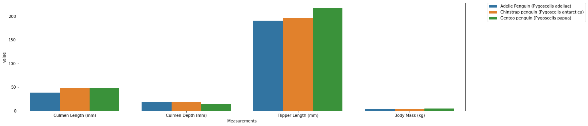

### Visualizing the Palmer Penguins Dataset

The purpose of this blog is to demonstrate a way of visualizing the Palmer Penguins dataset. In particular, I will create a barplot that displays the average *Culmen Length (mm)*, *Culmen Depth (mm)*, *Flipper Length (mm)* and *Body Mass (kg)* by *Species*.

First, let's import the relevant modules and read in the dataset.


```python
import pandas as pd
import seaborn as sns 
from matplotlib import pyplot as plt
url = "https://raw.githubusercontent.com/PhilChodrow/PIC16B/master/datasets/palmer_penguins.csv"
penguins = pd.read_csv(url)
```

We can check how the dataset looks like:


```python
penguins.head()
```

Next, we will group the dataframe by *Species*, and compute the average values for the four measurements.


```python
averages = penguins.groupby(["Species"])[["Culmen Length (mm)",
                                              "Culmen Depth (mm)",
                                              "Flipper Length (mm)",
                                             "Body Mass (g)"]].mean()
```


```python
Then, we need to convert *Body Mass (g)* to *Body Mass (kg)*, and remove *Body Mass (g)*. 
```


```python
averages["Body Mass (kg)"] = averages["Body Mass (g)"]/1000
averages = averages.drop('Body Mass (g)', axis = 1)
averages.head()
```

Now, we will remove the grouping by *Species*, and reorganize the dataframe so that the four measures, which are currently column names of the dataframe, become values of a new variable called *Measurements*. Their values will become a new variable called *value*. 


```python
averages = averages.reset_index()
averages = averages.melt(id_vars = "Species", value_vars = list(averages.columns)[1:],
                                           var_name = "Measurements")
averages.head()
```

Finally, we are ready to create a barplot which shows the four average measures by *Species*. Here I've made the graph wider by setting *figsize = (20, 5)* so that the names of the measures can be displayed properly. In addition, I've also made the legend appear outside of the plot for better display. 


```python
plt.figure(figsize = (20, 5))
fig = sns.barplot(x = "Measurements", y = "value", hue = "Species", data = averages)
fig.legend(bbox_to_anchor=(1.05, 1), loc='upper left', borderaxespad=0)
fig
```


    <AxesSubplot:xlabel='Measurements', ylabel='value'>


    


