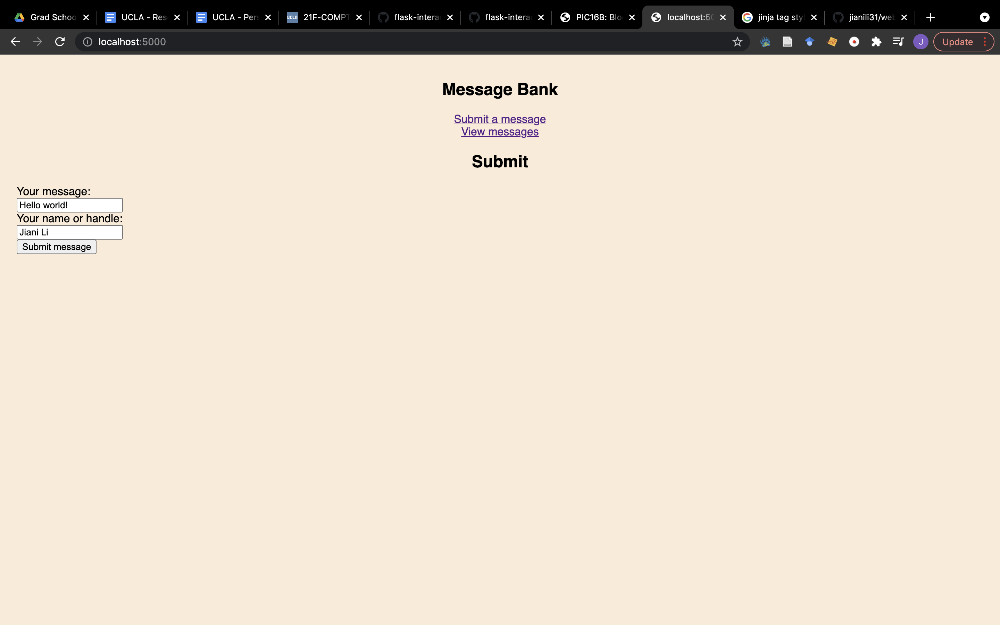
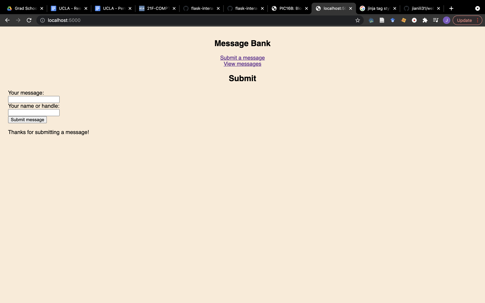
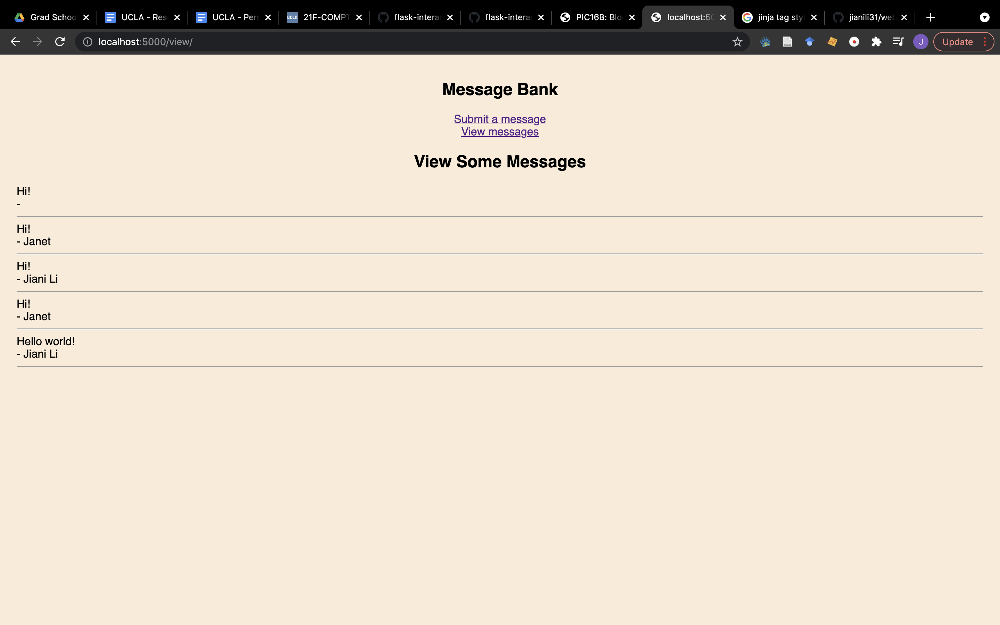

___
layout: post
title: My Blog 3
___

# Make a Web App for Suhmitting & Viewing Messages

This is a tutorial for constructing a web page for submitting & viewing messages. The link to my GitHub repository is: https://github.com/jianili31/webapp

## Functions

There are two main functionalities of this web page: inserting user's input into a database, and retrieving information from the database for display. 

### Connecting to a database & Inserting user's input into the database

This is achieved by the functions get_message_db(), which connects to a database, and insert_message(request), which insert user's input into the database.

```python
def get_message_db():
	# If there is no database called "message_db", create one
	if 'message_db' not in g:
		g.message_db = sqlite3.connect('message_db.sqlite')
	# Check if a table called "messages" exists in the database or not. If not, create one. 
	g.message_db.execute(
		'CREATE TABLE IF NOT EXISTS messages (ID integer, name varchar, message varchar);')
	# return the database
	return g.message_db
``` 

```python
def insert_message(request):
	# extract message and name entered by the user
	message = request.form['message']
	name = request.form['name']
	# get database
	db = get_message_db()
	# create a unique ID for the message, which is equal to the current # of rows in the database plus 1
	ID = db.execute('SELECT COUNT(*) FROM messages;').fetchone()[0]+1
	# insert the ID, name and message into the database
	db.execute(
		'INSERT INTO messages (ID, name, message) VALUES (?, ?, ?);',
		(ID, name, message))
	# commit the change
	db.commit()
	# close connection to the database
	db.close()
```

### Retrieving information from the database for display

This is achieved through the function random_messages(n), which returns n randomly selected messages from the database. max(n) = 5.

```python
def random_messages(n):
	# connect to the database
	db = get_message_db()
	# extract n random entries from the database
	entries = db.execute('SELECT name, message FROM messages ORDER BY RANDOM() LIMIT ?;', [n]).fetchall()
	# close the connection
	db.close()
	# return the entries
	return entries
```

## Templates

The templates used in this web app are: base.html, submit.html and view.html.

### base.html

This html file contains a title and a navigation section with the links to submit.html and view.html. It also leaves room for content in submit.html and view.html.


<!doctype html>
<link rel="stylesheet" href="{{ url_for('static', filename='style.css') }}">
<nav>
	<h1>Message Bank</h1>
  <!-- <b>Navigation:</b> -->
	<ul style="list-style-type:none;">
		<li><a href="{{ url_for('submit') }}">Submit a message</a></li>
		<li><a href="{{ url_for('view') }}">View messages</a></li>
	</ul>
</nav>
<section class="content">
  <header>
    
  </header>
  
</section>


### submit.html

This html file allows users to submit a message and their name or handle. When message is successfully submitted, it displays a thank-you message to the user. It also extends base.html so that the navigation links are available. 





	<h1>Submit</h1>



	<form method="post" enctype="multipart/form-data">
		<label for="message">Your message:</label><br>
		<input type="text" id="message" name="message"><br>
		<label for="name">Your name or handle:</label><br>
		<input type="text" id="name" name="name"><br>
		<input type="submit" value="Submit message">
	</form>

	
		<br>
		Thanks for submitting a message!
	




### view.html

This html file displays n randomly selected messages and names in the database. It also extends base.html so that the navigation links are available.





	<h1>View Some Messages</h1>



	
		{{ m[1] }}<br>
		- {{ m[0] }}<hr>
	




## app.py

This file contains two functions that render the submit.html and view.html templates. 

### submit(): render submit.html

```python
@app.route("/", methods = ['POST', 'GET'])
def submit():
	# when the web page is receiving inputs, render submit.html
	if request.method == "GET":
		return render_template('submit.html')
	# when the web page is posting inputs, render submit.html, passing the argument thanks = True to submit.html
	if request.method == "POST":
		# insert the message and name in the database
		insert_message(request=request)
		# render submit.html, passing the argument thanks = True to the template
		return render_template('submit.html', thanks = True)
```


### view(): render view.html

```python
@app.route("/view/", methods = ['POST', 'GET'])
def view():
	# get n randomly selected entries from the database
	entries = random_messages(5)
	# render view.html, passing the argument entries = entries to the template
	return render_template("view.html", entries = entries)
```

## Screencaps for my web pages








