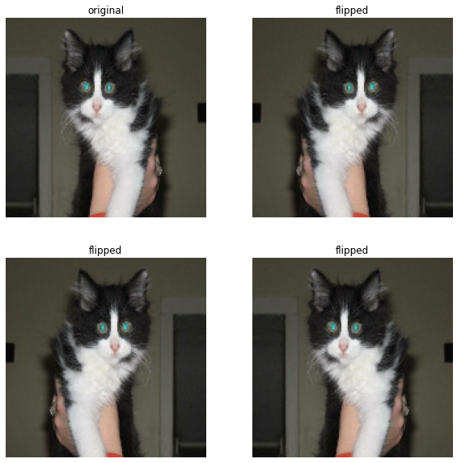

# Build a Binary Image Classifier 

In this blog, I will demonstrate how to build a Convolution Neural Network that allows us to classify images into two categories. 

## Preparation

First, let us import the relevant modules. 

```python
import tensorflow as tf
from tensorflow.keras import datasets, layers, models, utils
import matplotlib.pyplot as plt
import numpy as np
import os
```

We will now load in the datasets, which consist of labeled images of cats and dogs.

```python
# location of data
_URL = 'https://storage.googleapis.com/mledu-datasets/cats_and_dogs_filtered.zip'

# download the data and extract it
path_to_zip = utils.get_file('cats_and_dogs.zip', origin=_URL, extract=True)

# construct paths
PATH = os.path.join(os.path.dirname(path_to_zip), 'cats_and_dogs_filtered')

train_dir = os.path.join(PATH, 'train')
validation_dir = os.path.join(PATH, 'validation')

# parameters for datasets
BATCH_SIZE = 32
IMG_SIZE = (160, 160)

# construct train and validation datasets 
train_dataset = utils.image_dataset_from_directory(train_dir,
												   shuffle=True,
												   batch_size=BATCH_SIZE,
												   image_size=IMG_SIZE)

validation_dataset = utils.image_dataset_from_directory(validation_dir,
														shuffle=True,
														batch_size=BATCH_SIZE,
														image_size=IMG_SIZE)

# construct the test dataset by taking every 5th observation out of the validation dataset
val_batches = tf.data.experimental.cardinality(validation_dataset)
test_dataset = validation_dataset.take(val_batches // 5)
validation_dataset = validation_dataset.skip(val_batches // 5)
```

	Downloading data from https://storage.googleapis.com/mledu-datasets/cats_and_dogs_filtered.zip
	68608000/68606236 [==============================] - 1s 0us/step
	68616192/68606236 [==============================] - 1s 0us/step
	Found 2000 files belonging to 2 classes.
	Found 1000 files belonging to 2 classes.


## Create 2-Row Visualization of Images

We will now write a function that displays 6 random images of cats and dogs in the dataset in 2 rows. 

```python
def visualize_2rows(train_dataset):
	# get labels
	class_names = train_dataset.class_names
	# create an empty figure
	plt.figure(figsize=(10, 10))
	# sample random images and labels
	for images, labels in train_dataset.take(1):
		inds_cats = np.where(np.array(labels == 0))[0]
		inds_dogs = np.where(np.array(labels == 1))[0]
		labels_cats = np.random.choice(inds_cats, size = 3, replace = False)
		labels_dogs = np.random.choice(inds_dogs, size = 3, replace = False)
		labels_plot = np.concatenate((labels_cats, labels_dogs))
		images_plot = tf.gather(images, indices = labels_plot)
	# plot images of cats in the 1st row
	for i in range(3):
	  ax = plt.subplot(2, 3, i + 1)
	  plt.imshow(images_plot[i].numpy().astype("uint8"))
	  plt.title(class_names[0])
	  plt.axis("off")
	# plot images of dogs in the 2nd row
	for i in range(3, 6):
	  ax = plt.subplot(2, 3, i + 1)
	  plt.imshow(images_plot[i].numpy().astype("uint8"))
	  plt.title(class_names[1])
	  plt.axis("off")
```


```python
visualize_2rows(train_dataset)
```


	

	


## Check Label Frequencies

In order to ascertain the baseline performance, we need to check label frequencies in the dataset. 


```python
# create an iterator for the images
labels_iterator= train_dataset.unbatch().map(lambda image, label: label).as_numpy_iterator()
```


```python
# compute the number of dog labels (== 1)
sum(l for l in labels_iterator)
```


	1000


Since there are 2000 images in the training dataset, and 1000 of them are dogs, we can conclude that another 1000 are cats. 

Because we have the same amount of dog and cat images, the baseline model, which always guesses the most frequent label, should have an accuracy of 50%.

## First Model

We will build our first model now, which consists of 3 `Conv2D` layers, 2 `MaxPolling2D` layers, 2 `Dense` layers, and a `Dropout` layer. 

```python
model1 = models.Sequential([
	layers.Conv2D(32, (3, 3), activation='relu', input_shape=(160, 160, 3)),
	layers.MaxPooling2D((2, 2)),
	layers.Conv2D(64, (3, 3), activation='relu'),
	layers.MaxPooling2D((2, 2)),
	layers.Conv2D(128, (3, 3), activation='relu'),
	layers.Flatten(),
	layers.Dense(256, activation='relu'),
	layers.Dropout(0.25), 
	layers.Dense(2) # number of classes
])
```
Let's see how `Model 1` does.

```python
model1.compile(optimizer='adam',
			  loss=tf.keras.losses.SparseCategoricalCrossentropy(from_logits=True),
			  metrics=['accuracy'])

history = model1.fit(train_dataset, 
					 epochs=20, 
					 validation_data=validation_dataset)
```

	Epoch 1/20
	63/63 [==============================] - 4s 57ms/step - loss: 108.4062 - accuracy: 0.5310 - val_loss: 0.6844 - val_accuracy: 0.5792
	Epoch 2/20
	63/63 [==============================] - 4s 54ms/step - loss: 0.6549 - accuracy: 0.5920 - val_loss: 0.6920 - val_accuracy: 0.5582
	Epoch 3/20
	63/63 [==============================] - 4s 53ms/step - loss: 0.5395 - accuracy: 0.7090 - val_loss: 0.8047 - val_accuracy: 0.5767
	Epoch 4/20
	63/63 [==============================] - 4s 53ms/step - loss: 0.4017 - accuracy: 0.8140 - val_loss: 1.0607 - val_accuracy: 0.5371
	Epoch 5/20
	63/63 [==============================] - 4s 53ms/step - loss: 0.3383 - accuracy: 0.8460 - val_loss: 1.3634 - val_accuracy: 0.5681
	Epoch 6/20
	63/63 [==============================] - 4s 54ms/step - loss: 0.3053 - accuracy: 0.8735 - val_loss: 1.9770 - val_accuracy: 0.5681
	Epoch 7/20
	63/63 [==============================] - 4s 53ms/step - loss: 0.2436 - accuracy: 0.8940 - val_loss: 1.7599 - val_accuracy: 0.5446
	Epoch 8/20
	63/63 [==============================] - 4s 54ms/step - loss: 0.1603 - accuracy: 0.9335 - val_loss: 2.4683 - val_accuracy: 0.5606
	Epoch 9/20
	63/63 [==============================] - 4s 53ms/step - loss: 0.0901 - accuracy: 0.9660 - val_loss: 3.4461 - val_accuracy: 0.5606
	Epoch 10/20
	63/63 [==============================] - 4s 54ms/step - loss: 0.0671 - accuracy: 0.9770 - val_loss: 3.4349 - val_accuracy: 0.5631
	Epoch 11/20
	63/63 [==============================] - 4s 54ms/step - loss: 0.0591 - accuracy: 0.9795 - val_loss: 4.1940 - val_accuracy: 0.5693
	Epoch 12/20
	63/63 [==============================] - 4s 54ms/step - loss: 0.1850 - accuracy: 0.9470 - val_loss: 2.8167 - val_accuracy: 0.5681
	Epoch 13/20
	63/63 [==============================] - 4s 55ms/step - loss: 0.1253 - accuracy: 0.9660 - val_loss: 2.7447 - val_accuracy: 0.5458
	Epoch 14/20
	63/63 [==============================] - 4s 54ms/step - loss: 0.1303 - accuracy: 0.9580 - val_loss: 2.9122 - val_accuracy: 0.5606
	Epoch 15/20
	63/63 [==============================] - 4s 55ms/step - loss: 0.0698 - accuracy: 0.9810 - val_loss: 3.8213 - val_accuracy: 0.5520
	Epoch 16/20
	63/63 [==============================] - 4s 55ms/step - loss: 0.0264 - accuracy: 0.9935 - val_loss: 4.2067 - val_accuracy: 0.5767
	Epoch 17/20
	63/63 [==============================] - 4s 54ms/step - loss: 0.1322 - accuracy: 0.9590 - val_loss: 2.5444 - val_accuracy: 0.5359
	Epoch 18/20
	63/63 [==============================] - 4s 54ms/step - loss: 0.0984 - accuracy: 0.9735 - val_loss: 3.3998 - val_accuracy: 0.5705
	Epoch 19/20
	63/63 [==============================] - 4s 54ms/step - loss: 0.0534 - accuracy: 0.9865 - val_loss: 3.9754 - val_accuracy: 0.5767
	Epoch 20/20
	63/63 [==============================] - 4s 54ms/step - loss: 0.0598 - accuracy: 0.9840 - val_loss: 3.8754 - val_accuracy: 0.5606


```python
plt.plot(history.history["accuracy"], label = "training")
plt.plot(history.history["val_accuracy"], label = "validation")
plt.plot(np.full((20,), 0.52), label = "accuracy = 52%")
plt.gca().set(xlabel = "epoch", ylabel = "accuracy")
plt.legend()
```


	<matplotlib.legend.Legend at 0x7f783b623d90>


	

	


As the graph shows, the accuracy of `Model 1` stabilized **between 55% and 58%** during training. There was one iteration where accuracy was 51%, but on average the accuracy was higher than 52%. 
`Model 1` performed better than the baseline of 50%.
Overfitting was definitely an issue for `Model 1`, since the training accuracies got much higher than the validation accuracies.

# Model 2: With Data Augmentation

In the second model , we will incorporate steps of data augmentation, which will enhance our model's ability to classify images of different orientations.

```python
# randomly flipping the images
flip = layers.RandomFlip('horizontal')
```


```python
# display original + flipped images
for image, _ in train_dataset.take(1):
	# create an empty figure
	plt.figure(figsize=(10, 10))
	# grab the first image
	first_image = image[0]
	# create a grid of subplots
	ax = plt.subplot(2, 2, 1)
	# show the original image
	plt.imshow(first_image / 255)
	plt.title('original')
	plt.axis('off')
	# show the flipped images
	for i in range(1, 4):
		ax = plt.subplot(2, 2, i + 1)
		flipped_image = flip(tf.expand_dims(first_image, 0))
		plt.imshow(flipped_image[0] / 255)
		plt.title('flipped')
		plt.axis('off')
```


	

	


```python
# randomly rotating the images
rotation = layers.RandomRotation(0.2)
```


```python
# display original + rotated images
for image, _ in train_dataset.take(1):
	# create an empty figure
	plt.figure(figsize=(10, 10))
	# grab the first image
	first_image = image[0]
	# create a grid of subplots
	ax = plt.subplot(2, 2, 1)
	# show the original image
	plt.imshow(first_image / 255)
	plt.title('original')
	plt.axis('off')
	# show the rotated images
	for i in range(1, 4):
		ax = plt.subplot(2, 2, i + 1)
		rotated_image = rotation(tf.expand_dims(first_image, 0))
		plt.imshow(rotated_image[0] / 255)
		plt.title('rotated')
		plt.axis('off')
```


	

	

Now, we will build another model that incorporates the data augmentation steps outlined above. In addition, because we introduced more variations to the images, I added additional `Conv2D` layers. 

```python
model2 = models.Sequential([
	# data augmentation
	layers.RandomFlip('horizontal'), 
	layers.RandomRotation(0.05),
	# this part is the same as model 1
	layers.Conv2D(32, (3, 3), activation='relu', input_shape=(160, 160, 3)),
	layers.MaxPooling2D((2, 2)),
	layers.Conv2D(64, (3, 3), activation='relu'),
	layers.MaxPooling2D((2, 2)),
	layers.Conv2D(128, (3, 3), activation='relu'),
	layers.MaxPooling2D((2, 2)),
	# added additional Conv2D layers
	layers.Conv2D(256, (3, 3), activation='relu'),
	layers.MaxPooling2D((2, 2)),
	layers.Conv2D(256, (3, 3), activation='relu'),
	layers.Flatten(),
	layers.Dense(256, activation='relu'),
	layers.Dropout(0.25), 
	layers.Dense(2) # number of classes
])
```

Let's see how `Model 2` does. 

```python
model2.compile(optimizer='adam',
			  loss=tf.keras.losses.SparseCategoricalCrossentropy(from_logits=True),
			  metrics=['accuracy'])

history2 = model2.fit(train_dataset, 
					 epochs=20, 
					 validation_data=validation_dataset)
```

	Epoch 1/20
	63/63 [==============================] - 5s 57ms/step - loss: 7.1476 - accuracy: 0.5030 - val_loss: 0.6912 - val_accuracy: 0.5223
	Epoch 2/20
	63/63 [==============================] - 4s 54ms/step - loss: 0.6911 - accuracy: 0.5350 - val_loss: 0.6853 - val_accuracy: 0.5817
	Epoch 3/20
	63/63 [==============================] - 4s 54ms/step - loss: 0.6811 - accuracy: 0.5885 - val_loss: 0.6623 - val_accuracy: 0.6510
	Epoch 4/20
	63/63 [==============================] - 4s 53ms/step - loss: 0.6609 - accuracy: 0.6170 - val_loss: 0.6807 - val_accuracy: 0.5408
	Epoch 5/20
	63/63 [==============================] - 4s 54ms/step - loss: 0.6701 - accuracy: 0.6000 - val_loss: 0.6731 - val_accuracy: 0.5842
	Epoch 6/20
	63/63 [==============================] - 4s 55ms/step - loss: 0.6702 - accuracy: 0.5920 - val_loss: 0.6634 - val_accuracy: 0.6015
	Epoch 7/20
	63/63 [==============================] - 4s 54ms/step - loss: 0.6712 - accuracy: 0.5965 - val_loss: 0.9617 - val_accuracy: 0.5223
	Epoch 8/20
	63/63 [==============================] - 4s 54ms/step - loss: 0.6721 - accuracy: 0.6025 - val_loss: 0.6698 - val_accuracy: 0.5705
	Epoch 9/20
	63/63 [==============================] - 4s 55ms/step - loss: 0.6468 - accuracy: 0.6255 - val_loss: 0.6504 - val_accuracy: 0.6139
	Epoch 10/20
	63/63 [==============================] - 4s 55ms/step - loss: 0.6425 - accuracy: 0.6335 - val_loss: 0.6718 - val_accuracy: 0.6262
	Epoch 11/20
	63/63 [==============================] - 4s 54ms/step - loss: 0.6268 - accuracy: 0.6625 - val_loss: 0.6139 - val_accuracy: 0.6597
	Epoch 12/20
	63/63 [==============================] - 4s 56ms/step - loss: 0.6342 - accuracy: 0.6590 - val_loss: 0.6611 - val_accuracy: 0.6200
	Epoch 13/20
	63/63 [==============================] - 4s 55ms/step - loss: 0.6455 - accuracy: 0.6260 - val_loss: 0.6123 - val_accuracy: 0.6646
	Epoch 14/20
	63/63 [==============================] - 4s 54ms/step - loss: 0.6184 - accuracy: 0.6735 - val_loss: 0.6244 - val_accuracy: 0.6324
	Epoch 15/20
	63/63 [==============================] - 4s 54ms/step - loss: 0.6022 - accuracy: 0.6740 - val_loss: 0.6184 - val_accuracy: 0.6720
	Epoch 16/20
	63/63 [==============================] - 4s 55ms/step - loss: 0.6378 - accuracy: 0.6425 - val_loss: 0.6755 - val_accuracy: 0.6238
	Epoch 17/20
	63/63 [==============================] - 4s 55ms/step - loss: 0.6167 - accuracy: 0.6810 - val_loss: 0.6023 - val_accuracy: 0.6881
	Epoch 18/20
	63/63 [==============================] - 4s 54ms/step - loss: 0.5781 - accuracy: 0.6970 - val_loss: 0.6384 - val_accuracy: 0.6609
	Epoch 19/20
	63/63 [==============================] - 4s 54ms/step - loss: 0.5508 - accuracy: 0.7210 - val_loss: 0.6143 - val_accuracy: 0.7042
	Epoch 20/20
	63/63 [==============================] - 4s 54ms/step - loss: 0.5585 - accuracy: 0.7135 - val_loss: 0.5726 - val_accuracy: 0.7079


```python
plt.plot(history2.history["accuracy"], label = "training")
plt.plot(history2.history["val_accuracy"], label = "validation")
plt.plot(np.full((20,), 0.55), label = "accuracy = 55%")
plt.gca().set(xlabel = "epoch", ylabel = "accuracy")
plt.legend()
```


	<matplotlib.legend.Legend at 0x7f77ae3a7c10>


	

	


We can see that the model stablized at an accuracy of **68%**. There were a few initial iterations where accuracies fell below 55%, but the average accuracy was above 55%. `Model 2` was overall more accurate than `Model 1`. Overfitting did not seem to be present in `Model 2`, as training & validation accuracies were pretty similar.  


## Model 3: With Preprocessor

In this model, we will incorporate a data preprocessor that scales the RGB values to -1 and 1. 

```python
# create a preprocessing layer
i = tf.keras.Input(shape=(160, 160, 3))
x = tf.keras.applications.mobilenet_v2.preprocess_input(i)
preprocessor = tf.keras.Model(inputs = [i], outputs = [x])
```
Now, we will build a model that has the preprocessor, the same data augmentation layers as in `Model 2`, and the `Conv2D`, `MaxPooling2D` and `Dense` layers as in the previous models. This time, I changed the activation function to `LeakyReLU()` based on the fact that our RGB values now contain negative values, which the original `ReLU()` function would not be able to distinguish. I also changed the `kernel_initializer` to `he_uniform` based on some papers I read. 

```python
model3 = models.Sequential([
	preprocessor,
	layers.RandomFlip('horizontal'), 
	layers.RandomRotation(0.1),
	layers.Conv2D(32, (3, 3), activation=layers.LeakyReLU(), kernel_initializer='he_uniform', padding='same', input_shape=(160, 160, 3)),
	layers.MaxPooling2D((2, 2)),
	layers.Conv2D(64, (3, 3), activation=layers.LeakyReLU(), kernel_initializer='he_uniform', padding='same'),
	layers.MaxPooling2D((2, 2)), 
	layers.Conv2D(128, (3, 3), activation=layers.LeakyReLU(), kernel_initializer='he_uniform', padding='same'),
	layers.MaxPooling2D((2, 2)),
	layers.Conv2D(256, (3, 3), activation=layers.LeakyReLU(), kernel_initializer='he_uniform', padding='same'),
	layers.MaxPooling2D((2, 2)),
	layers.Conv2D(256, (3, 3), activation=layers.LeakyReLU(), kernel_initializer='he_uniform', padding='same'),
	layers.Flatten(),
	layers.Dense(512, activation=layers.LeakyReLU(), kernel_initializer='he_uniform'),
	layers.Dropout(0.25),
	layers.Dense(1,activation='sigmoid')
])
```


```python
model3.compile(optimizer='adam',loss='binary_crossentropy',metrics=['accuracy'])

history3 = model3.fit(train_dataset, 
					 epochs=20, 
					 validation_data=validation_dataset)
```

	Epoch 1/20
	63/63 [==============================] - 5s 60ms/step - loss: 5.1064 - accuracy: 0.5525 - val_loss: 0.6375 - val_accuracy: 0.6275
	Epoch 2/20
	63/63 [==============================] - 4s 56ms/step - loss: 0.6439 - accuracy: 0.6470 - val_loss: 0.6602 - val_accuracy: 0.6547
	Epoch 3/20
	63/63 [==============================] - 4s 58ms/step - loss: 0.6024 - accuracy: 0.6820 - val_loss: 0.6069 - val_accuracy: 0.6918
	Epoch 4/20
	63/63 [==============================] - 4s 58ms/step - loss: 0.5723 - accuracy: 0.6975 - val_loss: 0.6070 - val_accuracy: 0.6720
	Epoch 5/20
	63/63 [==============================] - 4s 62ms/step - loss: 0.5778 - accuracy: 0.7050 - val_loss: 0.5304 - val_accuracy: 0.7240
	Epoch 6/20
	63/63 [==============================] - 4s 59ms/step - loss: 0.5434 - accuracy: 0.7310 - val_loss: 0.5524 - val_accuracy: 0.7228
	Epoch 7/20
	63/63 [==============================] - 4s 58ms/step - loss: 0.5034 - accuracy: 0.7570 - val_loss: 0.5109 - val_accuracy: 0.7475
	Epoch 8/20
	63/63 [==============================] - 4s 58ms/step - loss: 0.5021 - accuracy: 0.7575 - val_loss: 0.5086 - val_accuracy: 0.7450
	Epoch 9/20
	63/63 [==============================] - 4s 59ms/step - loss: 0.5074 - accuracy: 0.7540 - val_loss: 0.5864 - val_accuracy: 0.7191
	Epoch 10/20
	63/63 [==============================] - 4s 59ms/step - loss: 0.4728 - accuracy: 0.7685 - val_loss: 0.5475 - val_accuracy: 0.7364
	Epoch 11/20
	63/63 [==============================] - 4s 61ms/step - loss: 0.4624 - accuracy: 0.7815 - val_loss: 0.5192 - val_accuracy: 0.7450
	Epoch 12/20
	63/63 [==============================] - 4s 57ms/step - loss: 0.4536 - accuracy: 0.7860 - val_loss: 0.5760 - val_accuracy: 0.7475
	Epoch 13/20
	63/63 [==============================] - 4s 60ms/step - loss: 0.4475 - accuracy: 0.7845 - val_loss: 0.5444 - val_accuracy: 0.7339
	Epoch 14/20
	63/63 [==============================] - 4s 59ms/step - loss: 0.4394 - accuracy: 0.7975 - val_loss: 0.4901 - val_accuracy: 0.7649
	Epoch 15/20
	63/63 [==============================] - 4s 57ms/step - loss: 0.4530 - accuracy: 0.7910 - val_loss: 0.5093 - val_accuracy: 0.7822
	Epoch 16/20
	63/63 [==============================] - 4s 57ms/step - loss: 0.4305 - accuracy: 0.8015 - val_loss: 0.5479 - val_accuracy: 0.7686
	Epoch 17/20
	63/63 [==============================] - 4s 59ms/step - loss: 0.4218 - accuracy: 0.8100 - val_loss: 0.5061 - val_accuracy: 0.7649
	Epoch 18/20
	63/63 [==============================] - 4s 58ms/step - loss: 0.4173 - accuracy: 0.8140 - val_loss: 0.5377 - val_accuracy: 0.7624
	Epoch 19/20
	63/63 [==============================] - 4s 58ms/step - loss: 0.3723 - accuracy: 0.8325 - val_loss: 0.5484 - val_accuracy: 0.7649
	Epoch 20/20
	63/63 [==============================] - 4s 57ms/step - loss: 0.3785 - accuracy: 0.8310 - val_loss: 0.5678 - val_accuracy: 0.7698


```python
plt.plot(history3.history["accuracy"], label = "training")
plt.plot(history3.history["val_accuracy"], label = "validation")
plt.plot(np.full((20,), 0.7), label = "accuracy = 70%")
plt.gca().set(xlabel = "epoch", ylabel = "accuracy")
plt.legend()
```


	<matplotlib.legend.Legend at 0x7f783c81e710>


	

	


After training, `Model 3`'s accuracy stablized at around **76%**, which is much higher than `Model 1`'s accuracy. Overfitting did not seem to be an issue for `Model 3`, as the training accuracies were not much higher than the validation accuracies. 

# Model 4: Transfer Learning

In the final model, we will use a pre-trained model called `MobileNet V2` to complete our classfication task. 

```python
# download MobileNet V2
IMG_SHAPE = IMG_SIZE + (3,)
base_model = tf.keras.applications.MobileNetV2(input_shape=IMG_SHAPE,
											   include_top=False,
											   weights='imagenet')
base_model.trainable = False

i = tf.keras.Input(shape=IMG_SHAPE)
x = base_model(i, training = False)
base_model_layer = tf.keras.Model(inputs = [i], outputs = [x])
```

	Downloading data from https://storage.googleapis.com/tensorflow/keras-applications/mobilenet_v2/mobilenet_v2_weights_tf_dim_ordering_tf_kernels_1.0_160_no_top.h5
	9412608/9406464 [==============================] - 0s 0us/step
	9420800/9406464 [==============================] - 0s 0us/step

We will build a model that includes the same `preprocessor` and `data augmentation` layers as before, but replace the `Conv2D` and `MaxPooling2D` layers with the `base_model_layer` we created based on `MobileNet V2`. 

```python
model4 = models.Sequential([
	preprocessor,
	layers.RandomFlip('horizontal'), 
	layers.RandomRotation(0.1),
	base_model_layer,
	layers.GlobalMaxPooling2D(),
	layers.Dense(2),
])
```
I added a `GlobalMaxPooling2D` layer after it for dimensionality reduction, as the `base_model_layer` is quite complex. 

```python
model4.summary()
```

	Model: "sequential_8"
	_________________________________________________________________
	 Layer (type)                Output Shape              Param #   
	=================================================================
	 model (Functional)          (None, 160, 160, 3)       0         
																	 
	 random_flip_10 (RandomFlip)  (None, 160, 160, 3)      0         
																	 
	 random_rotation_10 (RandomR  (None, 160, 160, 3)      0         
	 otation)                                                        
																	 
	 model_1 (Functional)        (None, 5, 5, 1280)        2257984   
																	 
	 global_max_pooling2d_1 (Glo  (None, 1280)             0         
	 balMaxPooling2D)                                                
																	 
	 dense_18 (Dense)            (None, 2)                 2562      
																	 
	=================================================================
	Total params: 2,260,546
	Trainable params: 2,562
	Non-trainable params: 2,257,984
	_________________________________________________________________


The `base_model_layer` indeed seems very complex, as it has 2257984 parameters. The entire model has 2562 trainable parameters.

We will now train `Model 4` on the validation dataset. 

```python
model4.compile(optimizer='adam',
			  loss=tf.keras.losses.SparseCategoricalCrossentropy(from_logits=True),
			  metrics=['accuracy'])

history4 = model4.fit(train_dataset, 
					 epochs=20, 
					 validation_data=validation_dataset)
```

	Epoch 1/20
	63/63 [==============================] - 7s 74ms/step - loss: 0.4409 - accuracy: 0.8795 - val_loss: 0.1282 - val_accuracy: 0.9592
	Epoch 2/20
	63/63 [==============================] - 4s 57ms/step - loss: 0.2034 - accuracy: 0.9450 - val_loss: 0.0805 - val_accuracy: 0.9740
	Epoch 3/20
	63/63 [==============================] - 4s 57ms/step - loss: 0.1436 - accuracy: 0.9520 - val_loss: 0.0797 - val_accuracy: 0.9728
	Epoch 4/20
	63/63 [==============================] - 4s 56ms/step - loss: 0.1160 - accuracy: 0.9655 - val_loss: 0.0800 - val_accuracy: 0.9740
	Epoch 5/20
	63/63 [==============================] - 4s 56ms/step - loss: 0.0926 - accuracy: 0.9685 - val_loss: 0.0656 - val_accuracy: 0.9839
	Epoch 6/20
	63/63 [==============================] - 4s 57ms/step - loss: 0.0909 - accuracy: 0.9710 - val_loss: 0.0660 - val_accuracy: 0.9765
	Epoch 7/20
	63/63 [==============================] - 4s 57ms/step - loss: 0.1049 - accuracy: 0.9630 - val_loss: 0.0718 - val_accuracy: 0.9752
	Epoch 8/20
	63/63 [==============================] - 4s 57ms/step - loss: 0.0932 - accuracy: 0.9700 - val_loss: 0.0704 - val_accuracy: 0.9790
	Epoch 9/20
	63/63 [==============================] - 4s 57ms/step - loss: 0.0995 - accuracy: 0.9680 - val_loss: 0.0636 - val_accuracy: 0.9790
	Epoch 10/20
	63/63 [==============================] - 4s 58ms/step - loss: 0.0844 - accuracy: 0.9725 - val_loss: 0.0654 - val_accuracy: 0.9790
	Epoch 11/20
	63/63 [==============================] - 4s 57ms/step - loss: 0.0567 - accuracy: 0.9750 - val_loss: 0.0875 - val_accuracy: 0.9740
	Epoch 12/20
	63/63 [==============================] - 4s 57ms/step - loss: 0.0995 - accuracy: 0.9680 - val_loss: 0.0778 - val_accuracy: 0.9790
	Epoch 13/20
	63/63 [==============================] - 4s 56ms/step - loss: 0.0706 - accuracy: 0.9765 - val_loss: 0.0795 - val_accuracy: 0.9765
	Epoch 14/20
	63/63 [==============================] - 4s 57ms/step - loss: 0.0491 - accuracy: 0.9800 - val_loss: 0.0718 - val_accuracy: 0.9765
	Epoch 15/20
	63/63 [==============================] - 4s 57ms/step - loss: 0.0799 - accuracy: 0.9740 - val_loss: 0.0792 - val_accuracy: 0.9790
	Epoch 16/20
	63/63 [==============================] - 4s 57ms/step - loss: 0.0728 - accuracy: 0.9755 - val_loss: 0.0980 - val_accuracy: 0.9715
	Epoch 17/20
	63/63 [==============================] - 4s 57ms/step - loss: 0.0698 - accuracy: 0.9730 - val_loss: 0.0784 - val_accuracy: 0.9790
	Epoch 18/20
	63/63 [==============================] - 4s 57ms/step - loss: 0.0533 - accuracy: 0.9815 - val_loss: 0.0748 - val_accuracy: 0.9752
	Epoch 19/20
	63/63 [==============================] - 4s 57ms/step - loss: 0.0996 - accuracy: 0.9660 - val_loss: 0.0698 - val_accuracy: 0.9802
	Epoch 20/20
	63/63 [==============================] - 4s 57ms/step - loss: 0.0792 - accuracy: 0.9745 - val_loss: 0.0763 - val_accuracy: 0.9827


```python
plt.plot(history4.history["accuracy"], label = "training")
plt.plot(history4.history["val_accuracy"], label = "validation")
plt.plot(np.full((20,), 0.95), label = "accuracy = 95%")
plt.gca().set(xlabel = "epoch", ylabel = "accuracy")
plt.legend()
```


	<matplotlib.legend.Legend at 0x7f783a67c810>


	

	


`Model 4` achieved a validation accuracy of around **98%**, which is way higher than accuracies of all previous models. Overfitting did not seem to be an issue for `Model` 4 as the training accuracies were not much higher than the validation accuracies. 

# Score on Test Data

Finally, we will apply our most performant model, `Model 4`, on the unseen testing dataset to evaluate its performace. 

```python
model4.compile(optimizer='adam',
			  loss=tf.keras.losses.SparseCategoricalCrossentropy(from_logits=True),
			  metrics=['accuracy'])

history4_test = model4.fit(train_dataset, 
					 epochs=20, 
					 validation_data=test_dataset)
```

	Epoch 1/20
	63/63 [==============================] - 6s 56ms/step - loss: 0.0682 - accuracy: 0.9790 - val_loss: 0.1243 - val_accuracy: 0.9635
	Epoch 2/20
	63/63 [==============================] - 3s 46ms/step - loss: 0.0558 - accuracy: 0.9815 - val_loss: 0.0894 - val_accuracy: 0.9740
	Epoch 3/20
	63/63 [==============================] - 3s 46ms/step - loss: 0.0589 - accuracy: 0.9810 - val_loss: 0.0881 - val_accuracy: 0.9688
	Epoch 4/20
	63/63 [==============================] - 3s 46ms/step - loss: 0.0728 - accuracy: 0.9740 - val_loss: 0.0692 - val_accuracy: 0.9844
	Epoch 5/20
	63/63 [==============================] - 3s 47ms/step - loss: 0.0413 - accuracy: 0.9835 - val_loss: 0.0811 - val_accuracy: 0.9844
	Epoch 6/20
	63/63 [==============================] - 3s 46ms/step - loss: 0.0567 - accuracy: 0.9820 - val_loss: 0.1143 - val_accuracy: 0.9740
	Epoch 7/20
	63/63 [==============================] - 3s 46ms/step - loss: 0.0395 - accuracy: 0.9850 - val_loss: 0.0445 - val_accuracy: 0.9844
	Epoch 8/20
	63/63 [==============================] - 3s 47ms/step - loss: 0.0731 - accuracy: 0.9805 - val_loss: 0.0744 - val_accuracy: 0.9792
	Epoch 9/20
	63/63 [==============================] - 3s 46ms/step - loss: 0.0293 - accuracy: 0.9910 - val_loss: 0.0856 - val_accuracy: 0.9792
	Epoch 10/20
	63/63 [==============================] - 3s 45ms/step - loss: 0.0592 - accuracy: 0.9810 - val_loss: 0.0663 - val_accuracy: 0.9792
	Epoch 11/20
	63/63 [==============================] - 3s 46ms/step - loss: 0.0776 - accuracy: 0.9770 - val_loss: 0.0928 - val_accuracy: 0.9740
	Epoch 12/20
	63/63 [==============================] - 3s 46ms/step - loss: 0.0677 - accuracy: 0.9815 - val_loss: 0.0486 - val_accuracy: 0.9948
	Epoch 13/20
	63/63 [==============================] - 3s 47ms/step - loss: 0.0492 - accuracy: 0.9850 - val_loss: 0.0859 - val_accuracy: 0.9792
	Epoch 14/20
	63/63 [==============================] - 3s 46ms/step - loss: 0.0418 - accuracy: 0.9865 - val_loss: 0.1257 - val_accuracy: 0.9688
	Epoch 15/20
	63/63 [==============================] - 3s 46ms/step - loss: 0.0557 - accuracy: 0.9840 - val_loss: 0.0887 - val_accuracy: 0.9740
	Epoch 16/20
	63/63 [==============================] - 3s 46ms/step - loss: 0.0561 - accuracy: 0.9810 - val_loss: 0.0672 - val_accuracy: 0.9844
	Epoch 17/20
	63/63 [==============================] - 3s 47ms/step - loss: 0.0286 - accuracy: 0.9915 - val_loss: 0.0331 - val_accuracy: 0.9896
	Epoch 18/20
	63/63 [==============================] - 3s 46ms/step - loss: 0.0380 - accuracy: 0.9875 - val_loss: 0.0878 - val_accuracy: 0.9740
	Epoch 19/20
	63/63 [==============================] - 3s 45ms/step - loss: 0.0329 - accuracy: 0.9885 - val_loss: 0.0777 - val_accuracy: 0.9792
	Epoch 20/20
	63/63 [==============================] - 3s 46ms/step - loss: 0.0413 - accuracy: 0.9860 - val_loss: 0.0463 - val_accuracy: 0.9896


```python
plt.plot(history4_test.history["accuracy"], label = "training")
plt.plot(history4_test.history["val_accuracy"], label = "testing")
plt.plot(np.full((20,), 0.95), label = "accuracy = 95%")
plt.gca().set(xlabel = "epoch", ylabel = "accuracy")
plt.legend()
```


	<matplotlib.legend.Legend at 0x7f783ab1e3d0>


	

	


`Model 4`, the most performant model, achieved around **98%** accuracy on the unseen testing dataset. Overfitting did not seem to be an issue. 
