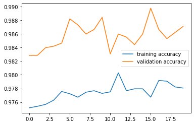
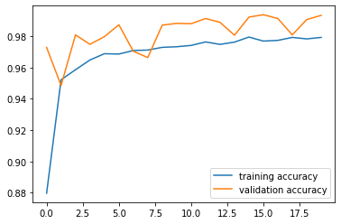
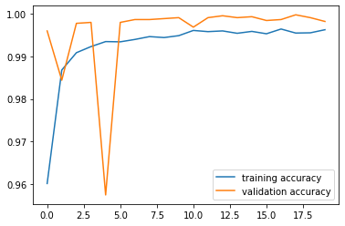
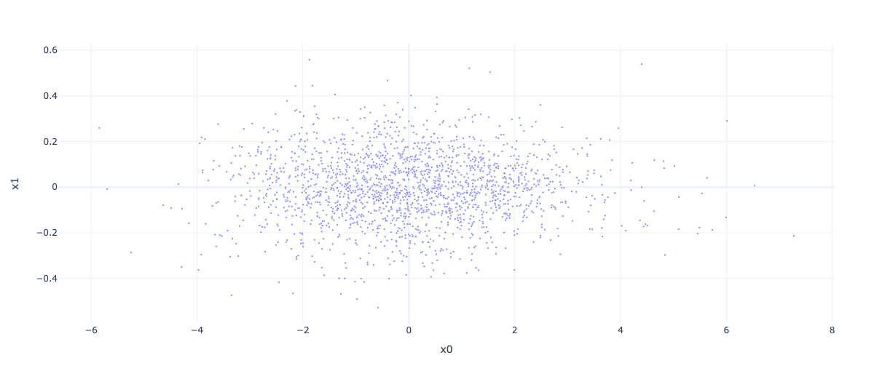
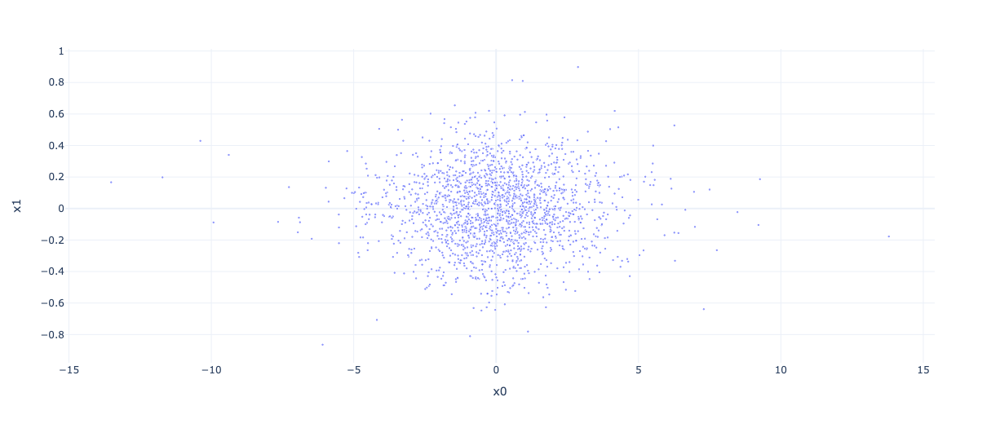

# Build a Fake News Classifier

In this blog post, I will demonstrate how to build a fake news classifier that can reliably tell if a piece of news is fake new or not.

## Import Modules

Let's first import the relevant modules. 

```python
import pandas as pd
import numpy as np
import tensorflow as tf
import re
import string

from tensorflow.keras import layers
from tensorflow.keras import losses

from tensorflow.keras.layers.experimental.preprocessing import TextVectorization
from tensorflow.keras.layers.experimental.preprocessing import StringLookup

from sklearn.model_selection import train_test_split
from sklearn.preprocessing import LabelEncoder

# for embedding viz
import plotly.express as px 
import plotly.io as pio
pio.templates.default = "plotly_white"

# for removing stopwords
import nltk
nltk.download('stopwords')

# for plotting training history
from matplotlib import pyplot as plt
```

    [nltk_data] Downloading package stopwords to /root/nltk_data...
    [nltk_data]   Package stopwords is already up-to-date!


    True


## Data Preparation

We will now prepare our training and validation datasets. 

```python
train_url = "https://github.com/PhilChodrow/PIC16b/blob/master/datasets/fake_news_train.csv?raw=true"
data = pd.read_csv(train_url)
```

I will define a function, `make_dataset()`, that:
1. removes all stopwords (e.g. "the", "and", "but");
2. transforms the dataframe into a Tensorflow dataset with `title` and `text` as inputs, and `fake` as output. 

```python
def make_dataset(df):
  # grab stopwords
  stopwords = nltk.corpus.stopwords.words('english')
  # remove stopwords from text and title
  df['text_no_stopwords'] = df['text'].apply(lambda x: ' '.join([word for word in x.split() if word not in (stopwords)]))
  df['title_no_stopwords'] = df['title'].apply(lambda x: ' '.join([word for word in x.split() if word not in (stopwords)]))
  # construct a tensorflow dataset from dataframe columns
  data = tf.data.Dataset.from_tensor_slices(
      (
          # input: title & text
          {
              "title" : df[["title_no_stopwords"]], 
              "text" : df[["text_no_stopwords"]]
          }, 
          # output: fake
          {
              "fake" : df[["fake"]]
          }
      )
  )
  # batch the dataset
  data.batch(100)
  return data
```

Let's now make the dataset!

```python
dataset = make_dataset(data)
```
To take a look at the dataset:

```python
for content, _ in dataset.take(5):
    print(content["title"])
    print(content["text"])
    print("")
```

    tf.Tensor([b"Merkel: Strong result Austria's FPO 'big challenge' parties"], shape=(1,), dtype=string)
    tf.Tensor([b'German Chancellor Angela Merkel said Monday strong showing Austria anti-immigrant Freedom Party (FPO) Sunday election big challenge parties. Speaking news conference Berlin, Merkel added hoping close cooperation Austria conservative election winner Sebastian Kurz European level.'], shape=(1,), dtype=string)
    
    tf.Tensor([b'Trump says Pence lead voter fraud panel'], shape=(1,), dtype=string)
    tf.Tensor([b'WEST PALM BEACH, Fla.President Donald Trump said remarks broadcast Sunday would put Vice President Mike Pence charge commission probe believes voter fraud last November\'s election. There overwhelming consensus among state officials, election experts, politicians voter fraud rare United States, Trump repeatedly said thinks perhaps millions votes cast Nov. 8 election fraudulent. "I\'m going set commission headed Vice President Pence we\'re going look very, carefully," Trump told Fox News Channel\'s Bill O\'Reilly interview taped Friday. Trump, spending weekend Mar-a-Lago resort Palm Beach, Florida, captured presidency winning enough state-by-state Electoral College votes defeat Democrat Hillary Clinton. Still, Clinton popular vote nearly 3 million votes, piling overwhelming majority deeply Democratic states like California. This irked Trump result claimed voter fraud without evidence. Senate Majority Leader Mitch McConnell, Kentucky Republican, said \'s "State Union" election fraud occur "there evidence occurred significant number would changed presidential election." "And I think ought spend federal money investigating that. I think states take look issue," said.'], shape=(1,), dtype=string)
    
    tf.Tensor([b'JUST IN: SUSPECTED LEAKER \xe2\x80\x9cClose Confidant\xe2\x80\x9d James Comey Has Been Reassigned From His Post As TOP FBI Lawyer [VIDEO]'], shape=(1,), dtype=string)
    tf.Tensor([b'On December 5, 2017, Circa Sara Carter warned would major shake-up FBI Inspector General report completed. So far, Sara Carter right everything reported on, relates Mueller investigation. In below, Carter tells Sean Hannity believes FBI major shake-up soon 27 leakers IG looking at! Yes, 27 leakers!Sara Carter: We going see parts report December (end month). We going see parts report coming January. And looking Peter Strzok. They looking Comey. They looking 27 leakers. It would surprise shake-up FBI housecleaning.Watch:Is FBI former top attorney, James Baker, one first leaker casualties? James Baker, FBI leading lawyer confidante fired FBI Director James Comey, reassigned post, agency top personnel high scrutiny.Baker told colleagues assume different duties bureau, Washington Post reported.Baker oversees bureau Office General Counsel received awards George H.W. Bush Award Excellence counter-terrorism 2006.He also subject leak investigation summer Attorney General Jeff Sessions ordered crackdown leakers.The FBI comment asked Baker reassigned would doing.His reassignment comes time increased scrutiny pressure agency, following release private text messages agents working Hillary Clinton email probe. Daily Mail Three sources, knowledge investigation, told Circa Baker top suspect ongoing leak investigation, Circa able confirm details national security information material allegedly leaked.A federal law enforcement official knowledge ongoing internal investigations bureau told Circa, bureau scouring leakers lot investigations. The revelation comes Trump administration ramped efforts contain leaks within White House within national security apparatus.Baker close confidant former FBI Director James Comey, recent media reports suggested reportedly advising then-FBI director legal matters following private meetings former director February President Trump Oval Office.Baker appointed FBI general counsel Comey 2014 long distinguished history within intelligence community.'], shape=(1,), dtype=string)
    
    tf.Tensor([b'Thyssenkrupp offered help Argentina disappeared submarine'], shape=(1,), dtype=string)
    tf.Tensor([b'Germany Thyssenkrupp, offered assistance Argentinian authorities investigation disappearance submarine last month, spokesman said Friday. The ARA San Juan delivered 1985 built unit Thyssen AG, merged Krupp form Thyssenkrupp 1999. We offered support technical investigation tragedy contact Argentinian navy respect, spokesman said. He said maintenance submarine conducted Thyssenkrupp. The submarine went missing Nov. 15 44 crew members aboard South Atlantic waters. The navy said Nov. 27 water entered submarine snorkel caused battery short circuit went missing. The tragedy underscored critics described parlous state Argentina military, faced dwindling funding years. German magazine WirtschaftsWoche earlier reported delegation Argentinian Navy traveled Kiel northern Germany discuss questions submarine Thyssenkrupp. It identify sources. Argentinian President Mauricio Macri called serious deep investigation incident.'], shape=(1,), dtype=string)
    
    tf.Tensor([b"Trump say appeals court decision travel ban 'political'"], shape=(1,), dtype=string)
    tf.Tensor([b'President Donald Trump Thursday called appellate court ruling upheld suspension order restricting travel seven Muslim-majority countries "political decision," vowed administration would ultimately prevail. "We\'ll see court," Trump told reporters gathered outside press secretary\'s office. "It\'s political decision." Trump said view ruling major setback White House. "This decision came down, we\'re going win case," said.'], shape=(1,), dtype=string)
    

The dataset looks great! Now we will split it into training (80%) and validation (20%) sets.

```python
# perform train-validation split
dataset = dataset.shuffle(buffer_size = len(dataset))
train_size = int(0.8*len(dataset))
val_size   = int(0.2*len(dataset))

train = dataset.take(train_size)
val   = dataset.skip(train_size).take(val_size)
```

To enhance model performance, we will preprocess content in the `train` dataset only. First, we will `standardize` the strings by converting all capital letters to lower-case letters, and removing all punctuations. Then, we will `vectorize` all titles and texts by representing words as their frequency ranks.

```python
# preprocessing

# standardization: remove punctuations, convert capital letters to lower-case letters
def standardization(input_data):
    lowercase = tf.strings.lower(input_data)
    no_punctuation = tf.strings.regex_replace(lowercase,
                                  '[%s]' % re.escape(string.punctuation),'')
    return no_punctuation

# vectorization
size_vocabulary = 2000
vectorize_title = TextVectorization(
    standardize=standardization,
    max_tokens=size_vocabulary, # only consider this many words
    output_mode='int',
    output_sequence_length=20) 

vectorize_text = TextVectorization(
    standardize=standardization,
    max_tokens=size_vocabulary, # only consider this many words
    output_mode='int',
    output_sequence_length=1500) 

vectorize_title.adapt(train.map(lambda x, y: x["title"]))
vectorize_text.adapt(train.map(lambda x, y: x["text"]))
```
To determine the baseline performance of the model, we will count how many pieces of fake news there are in the training dataset, and divide it by the total number of news pieces. 

```python
# determine base rate
num_fake = 0
for _, fake in train:
  num_fake = num_fake + fake['fake']
```

```python
# percentage of fake news
num_fake / len(train)
```


    <tf.Tensor: shape=(1,), dtype=float64, numpy=array([0.52374854])>

We can see that there are around **52.4%** of fake news in our training dataset, suggesting that the baseline accuracy should be around **52.4%**. 

## Model Building

In this section, we want to answer this question: When detecting fake news, is it most effective to focus on only the title of the article, the full text of the article, or both?
To address this question, we will build three models and compare their validation accuracies:
1. Uses only article titles as input
2. Uses only article texts as input
3. Uses both titles & texts as input

### Model 1: Use Only the Article Title as an Input

For `Model 1`, I adopted the network architecture presented in lecture because it performed very well on the preprocessed data. The only differences are: 1) titles are the only input; 2) the final `Dense` layer has 2 nodes, which is the same as the number of classes (fake vs. true).

```python
# specify article titles as input
title_input = tf.keras.Input(
    shape = (1,), 
    name = "title",
    dtype = "string"
)

num_classes = 2
# layers for processing the titles
# vectorized input layer
title_features = vectorize_title(title_input)
# embedding layer
title_features = layers.Embedding(size_vocabulary, 3, name = "embedding1")(title_features)
# dropout layer to control for overfitting
title_features = layers.Dropout(0.2)(title_features)
# global average pooling
title_features = layers.GlobalAveragePooling1D()(title_features)
# dropout layer to control for overfitting
title_features = layers.Dropout(0.2)(title_features)
# dense layer
title_features = layers.Dense(32, activation='relu')(title_features)
# output layer = dense layer with 2 nodes
output = layers.Dense(num_classes, name = "fake")(title_features)
```
Putting the input and output layers together:

```python
# build model 1
model1 = tf.keras.Model(
    inputs = title_input,
    outputs = output
)
```


```python
model1.summary()
```

    Model: "model"
    _________________________________________________________________
     Layer (type)                Output Shape              Param #   
    =================================================================
     title (InputLayer)          [(None, 1)]               0         
                                                                     
     text_vectorization (TextVec  (None, 20)               0         
     torization)                                                     
                                                                     
     embedding (Embedding)       (None, 20, 3)             6000      
                                                                     
     dropout_4 (Dropout)         (None, 20, 3)             0         
                                                                     
     global_average_pooling1d_2   (None, 3)                0         
     (GlobalAveragePooling1D)                                        
                                                                     
     dropout_5 (Dropout)         (None, 3)                 0         
                                                                     
     dense_2 (Dense)             (None, 32)                128       
                                                                     
     fake (Dense)                (None, 2)                 66        
                                                                     
    =================================================================
    Total params: 6,194
    Trainable params: 6,194
    Non-trainable params: 0
    _________________________________________________________________

Let's now train `Model 1` and evaluate it on the validation dataset.

```python
# train model 1
model1.compile(optimizer = "adam",
              loss = losses.SparseCategoricalCrossentropy(from_logits=True),
              metrics=['accuracy']
)
history1 = model1.fit(train, 
                    validation_data=val,
                    epochs = 20, 
                    verbose = False)
```

    /usr/local/lib/python3.7/dist-packages/keras/engine/functional.py:559: UserWarning:
    
    Input dict contained keys ['text'] which did not match any model input. They will be ignored by the model.
    


```python
from matplotlib import pyplot as plt
# plot training history
plt.plot(history1.history["accuracy"])
plt.plot(history1.history["val_accuracy"])
plt.legend(["training accuracy", "validation accuracy"])
```


    <matplotlib.legend.Legend at 0x7f1a80e87d10>


    

    
As we can see, validation accuracy stabilized at around **98.5%**.

### Model 2: Use Only the Article Text as an Input

For `Model 2`, I again adopted the network architecture presented in lecture because it performed very well on the preprocessed data. The only differences are: 1) texts are the only input; 2) the final `Dense` layer has 2 nodes, which is the same as the number of classes (fake vs. true).

```python
# specify article text as input
text_input = tf.keras.Input(
    shape = (1,), 
    name = "text",
    dtype = "string"
)

num_classes = 2
# layers for processing the texts
# vectorized input layer
text_features = vectorize_text(text_input)
# embedding layer
text_features = layers.Embedding(size_vocabulary, 3, name = "embedding2")(text_features)
# dropout layer to control for overfitting
text_features = layers.Dropout(0.2)(text_features)
# global average pooling layer
text_features = layers.GlobalAveragePooling1D()(text_features)
# dropout layer to control for overfitting
text_features = layers.Dropout(0.2)(text_features)
# dense layer
text_features = layers.Dense(32, activation='relu')(text_features)
# output layer = dense layer with 2 nodes
output_text = layers.Dense(num_classes, name = "fake")(text_features)
```
Let's know put the layers together.

```python
# build model 2
model2 = tf.keras.Model(
    inputs = text_input,
    outputs = output_text
)
```


```python
model2.summary()
```

    Model: "model_5"
    _________________________________________________________________
     Layer (type)                Output Shape              Param #   
    =================================================================
     text (InputLayer)           [(None, 1)]               0         
                                                                     
     text_vectorization_5 (TextV  multiple                 0         
     ectorization)                                                   
                                                                     
     embedding (Embedding)       (None, 1500, 3)           6000      
                                                                     
     dropout_17 (Dropout)        (None, 1500, 3)           0         
                                                                     
     global_average_pooling1d_9   (None, 3)                0         
     (GlobalAveragePooling1D)                                        
                                                                     
     dropout_18 (Dropout)        (None, 3)                 0         
                                                                     
     dense_8 (Dense)             (None, 32)                128       
                                                                     
     fake (Dense)                (None, 2)                 66        
                                                                     
    =================================================================
    Total params: 6,194
    Trainable params: 6,194
    Non-trainable params: 0
    _________________________________________________________________

Let's train `Model 2` and evaluate it on the validation dataset. 

```python
# train model 2
model2.compile(optimizer = "adam",
              loss = losses.SparseCategoricalCrossentropy(from_logits=True),
              metrics=['accuracy']
)
history2 = model2.fit(train, 
                    validation_data=val,
                    epochs = 20, 
                    verbose = True)
```

    Epoch 1/20


    /usr/local/lib/python3.7/dist-packages/keras/engine/functional.py:559: UserWarning:
    
    Input dict contained keys ['title'] which did not match any model input. They will be ignored by the model.
    


    17959/17959 [==============================] - 41s 2ms/step - loss: 0.2756 - accuracy: 0.8797 - val_loss: 0.1122 - val_accuracy: 0.9728
    Epoch 2/20
    17959/17959 [==============================] - 41s 2ms/step - loss: 0.1335 - accuracy: 0.9522 - val_loss: 0.1270 - val_accuracy: 0.9485
    Epoch 3/20
    17959/17959 [==============================] - 46s 3ms/step - loss: 0.1171 - accuracy: 0.9586 - val_loss: 0.0691 - val_accuracy: 0.9808
    Epoch 4/20
    17959/17959 [==============================] - 41s 2ms/step - loss: 0.1007 - accuracy: 0.9648 - val_loss: 0.0815 - val_accuracy: 0.9748
    Epoch 5/20
    17959/17959 [==============================] - 41s 2ms/step - loss: 0.0900 - accuracy: 0.9688 - val_loss: 0.0671 - val_accuracy: 0.9797
    Epoch 6/20
    17959/17959 [==============================] - 42s 2ms/step - loss: 0.0859 - accuracy: 0.9686 - val_loss: 0.0526 - val_accuracy: 0.9873
    Epoch 7/20
    17959/17959 [==============================] - 41s 2ms/step - loss: 0.0800 - accuracy: 0.9709 - val_loss: 0.0625 - val_accuracy: 0.9704
    Epoch 8/20
    17959/17959 [==============================] - 41s 2ms/step - loss: 0.0797 - accuracy: 0.9712 - val_loss: 0.0704 - val_accuracy: 0.9664
    Epoch 9/20
    17959/17959 [==============================] - 40s 2ms/step - loss: 0.0754 - accuracy: 0.9729 - val_loss: 0.0557 - val_accuracy: 0.9871
    Epoch 10/20
    17959/17959 [==============================] - 40s 2ms/step - loss: 0.0757 - accuracy: 0.9733 - val_loss: 0.0378 - val_accuracy: 0.9882
    Epoch 11/20
    17959/17959 [==============================] - 40s 2ms/step - loss: 0.0731 - accuracy: 0.9741 - val_loss: 0.0432 - val_accuracy: 0.9880
    Epoch 12/20
    17959/17959 [==============================] - 40s 2ms/step - loss: 0.0638 - accuracy: 0.9763 - val_loss: 0.0340 - val_accuracy: 0.9913
    Epoch 13/20
    17959/17959 [==============================] - 41s 2ms/step - loss: 0.0674 - accuracy: 0.9748 - val_loss: 0.0409 - val_accuracy: 0.9889
    Epoch 14/20
    17959/17959 [==============================] - 41s 2ms/step - loss: 0.0634 - accuracy: 0.9762 - val_loss: 0.0519 - val_accuracy: 0.9806
    Epoch 15/20
    17959/17959 [==============================] - 40s 2ms/step - loss: 0.0607 - accuracy: 0.9795 - val_loss: 0.0290 - val_accuracy: 0.9922
    Epoch 16/20
    17959/17959 [==============================] - 41s 2ms/step - loss: 0.0615 - accuracy: 0.9769 - val_loss: 0.0273 - val_accuracy: 0.9938
    Epoch 17/20
    17959/17959 [==============================] - 41s 2ms/step - loss: 0.0576 - accuracy: 0.9773 - val_loss: 0.0386 - val_accuracy: 0.9913
    Epoch 18/20
    17959/17959 [==============================] - 41s 2ms/step - loss: 0.0591 - accuracy: 0.9792 - val_loss: 0.0482 - val_accuracy: 0.9808
    Epoch 19/20
    17959/17959 [==============================] - 41s 2ms/step - loss: 0.0589 - accuracy: 0.9783 - val_loss: 0.0337 - val_accuracy: 0.9906
    Epoch 20/20
    17959/17959 [==============================] - 46s 3ms/step - loss: 0.0534 - accuracy: 0.9792 - val_loss: 0.0240 - val_accuracy: 0.9933


```python
# plot model trianing history
plt.plot(history2.history["accuracy"])
plt.plot(history2.history["val_accuracy"])
plt.legend(["training accuracy", "validation accuracy"])
```


    <matplotlib.legend.Legend at 0x7f1a91ebd950>


    

    
As we can see, validation accuracy stabilized at around **97.5%**.


### Model 3: Use Both Title & Text as Inputs

For `Model 3`, I again adopted the network architecture presented in lecture because it performed very well on the preprocessed data. The only differences are: 1) titles and texts are the inputs; 2) the final `Dense` layer has 2 nodes, which is the same as the number of classes (fake vs. true).


```python
# concatenate title & text processing layers
main = layers.concatenate([title_features, text_features], axis = 1)
# add a dense layer
main = layers.Dense(32, activation='relu')(main)
# output layer = dense layer with 2 nodes
output_title_text = layers.Dense(num_classes, name = "fake")(main)
```
Let's put the layers together.

```python
# build model 3
model3 = tf.keras.Model(
    inputs = [title_input, text_input],
    outputs = output_title_text
)
```
Let's train `Model 3` and evaluate it on the validation dataset.

```python
# train model 3
model3.compile(optimizer = "adam",
              loss = losses.SparseCategoricalCrossentropy(from_logits=True),
              metrics=['accuracy']
)
history3 = model3.fit(train, 
                    validation_data=val,
                    epochs = 20, 
                    verbose = True)
```

    Epoch 1/20
    17959/17959 [==============================] - 55s 3ms/step - loss: 0.1029 - accuracy: 0.9601 - val_loss: 0.0122 - val_accuracy: 0.9960
    Epoch 2/20
    17959/17959 [==============================] - 56s 3ms/step - loss: 0.0378 - accuracy: 0.9868 - val_loss: 0.0362 - val_accuracy: 0.9844
    Epoch 3/20
    17959/17959 [==============================] - 65s 4ms/step - loss: 0.0289 - accuracy: 0.9909 - val_loss: 0.0087 - val_accuracy: 0.9978
    Epoch 4/20
    17959/17959 [==============================] - 63s 4ms/step - loss: 0.0237 - accuracy: 0.9923 - val_loss: 0.0066 - val_accuracy: 0.9980
    Epoch 5/20
    17959/17959 [==============================] - 68s 4ms/step - loss: 0.0202 - accuracy: 0.9935 - val_loss: 0.1100 - val_accuracy: 0.9575
    Epoch 6/20
    17959/17959 [==============================] - 66s 4ms/step - loss: 0.0205 - accuracy: 0.9934 - val_loss: 0.0084 - val_accuracy: 0.9980
    Epoch 7/20
    17959/17959 [==============================] - 51s 3ms/step - loss: 0.0187 - accuracy: 0.9940 - val_loss: 0.0043 - val_accuracy: 0.9987
    Epoch 8/20
    17959/17959 [==============================] - 49s 3ms/step - loss: 0.0157 - accuracy: 0.9947 - val_loss: 0.0057 - val_accuracy: 0.9987
    Epoch 9/20
    17959/17959 [==============================] - 51s 3ms/step - loss: 0.0169 - accuracy: 0.9944 - val_loss: 0.0035 - val_accuracy: 0.9989
    Epoch 10/20
    17959/17959 [==============================] - 48s 3ms/step - loss: 0.0156 - accuracy: 0.9949 - val_loss: 0.0044 - val_accuracy: 0.9991
    Epoch 11/20
    17959/17959 [==============================] - 50s 3ms/step - loss: 0.0134 - accuracy: 0.9961 - val_loss: 0.0084 - val_accuracy: 0.9969
    Epoch 12/20
    17959/17959 [==============================] - 57s 3ms/step - loss: 0.0136 - accuracy: 0.9958 - val_loss: 0.0035 - val_accuracy: 0.9991
    Epoch 13/20
    17959/17959 [==============================] - 51s 3ms/step - loss: 0.0135 - accuracy: 0.9960 - val_loss: 0.0030 - val_accuracy: 0.9996
    Epoch 14/20
    17959/17959 [==============================] - 47s 3ms/step - loss: 0.0129 - accuracy: 0.9954 - val_loss: 0.0029 - val_accuracy: 0.9991
    Epoch 15/20
    17959/17959 [==============================] - 58s 3ms/step - loss: 0.0130 - accuracy: 0.9959 - val_loss: 0.0022 - val_accuracy: 0.9993
    Epoch 16/20
    17959/17959 [==============================] - 61s 3ms/step - loss: 0.0131 - accuracy: 0.9953 - val_loss: 0.0059 - val_accuracy: 0.9984
    Epoch 17/20
    17959/17959 [==============================] - 56s 3ms/step - loss: 0.0119 - accuracy: 0.9964 - val_loss: 0.0033 - val_accuracy: 0.9987
    Epoch 18/20
    17959/17959 [==============================] - 57s 3ms/step - loss: 0.0153 - accuracy: 0.9955 - val_loss: 0.0020 - val_accuracy: 0.9998
    Epoch 19/20
    17959/17959 [==============================] - 52s 3ms/step - loss: 0.0131 - accuracy: 0.9955 - val_loss: 0.0041 - val_accuracy: 0.9991
    Epoch 20/20
    17959/17959 [==============================] - 49s 3ms/step - loss: 0.0113 - accuracy: 0.9963 - val_loss: 0.0036 - val_accuracy: 0.9982


```python
# plot model trianing history
plt.plot(history3.history["accuracy"])
plt.plot(history3.history["val_accuracy"])
plt.legend(["training accuracy", "validation accuracy"])
```


    <matplotlib.legend.Legend at 0x7f1a7c723ed0>


    

    
The validation accuracy of `Model 3` was around **99.5%**

## Evaluate Model 3 on Test Dataset

Since `Model 3` achieved the highest validation accuracy out of the 3 models, we will now evaluate it on the unseen test dataset.
Let's prepare our test dataset.

```python
# prepare test dataset
test_url = "https://github.com/PhilChodrow/PIC16b/blob/master/datasets/fake_news_test.csv?raw=true"
test = pd.read_csv(test_url)
test_dataset = make_dataset(test)
```
Evaluating `Model 3` on the test dataset:

```python
# evaluate model 3 on test dataset
model3.evaluate(test_dataset, verbose = 2)
```

    22449/22449 - 26s - loss: 0.0288 - accuracy: 0.9922 - 26s/epoch - 1ms/step


    [0.028797993436455727, 0.9922045469284058]

`Model 3` achieved an accuracy of **99.2%** on the test dataset. Awesome!

## Visualize Word Embedding in Model 3

What has `Model 3` learned about our dataset? We will answer this question by visualizing the word embeddings for both titles and texts.
We will first get the weights and vocabulary from the embedding layers and vectorize layers.

```python
weights_title = model3.get_layer('embedding1').get_weights()[0] # get the weights from the embedding layer
weights_text = model3.get_layer('embedding2').get_weights()[0] # get the weights from the embedding layer
vocab_title = vectorize_title.get_vocabulary()                # get the vocabulary from our data prep for later
vocab_text = vectorize_text.get_vocabulary()                # get the vocabulary from our data prep for later
```


```python
from sklearn.decomposition import PCA
pca_title = PCA(n_components=2)
pca_text = PCA(n_components=2)
weights_title = pca_title.fit_transform(weights_title)
weights_text = pca_text.fit_transform(weights_text)
```
Putting weights and vocabulaty for titles into a dataframe:

```python
embedding_title = pd.DataFrame({
    'title' : vocab_title, 
    'x0'   : weights_title[:,0],
    'x1'   : weights_title[:,1],
})
```
Now we will plot out the words in a 2D space.


```python
import plotly.express as px 
fig1 = px.scatter(embedding_title, 
                 x = "x0", 
                 y = "x1", 
                 size = list(np.ones(len(embedding_title))),
                 size_max = 2,
                 hover_name = "title")

fig1.show()
```




The embedding of titles seems to have learned to associate "candidates", "electoral", "romney", "trudeau" and "military" together, which are all words with political connotations.

We will now do the same for word embeddings for texts.

```python
embedding_text = pd.DataFrame({
    'text' : vocab_text, 
    'x0'   : weights_text[:,0],
    'x1'   : weights_text[:,1],
})
```


```python
fig2 = px.scatter(embedding_text, 
                 x = "x0", 
                 y = "x1", 
                 size = list(np.ones(len(embedding_text))),
                 size_max = 2,
                 hover_name = "text")

fig2.show()
```




The embedding of texts seems to have learned to associate "organization", "mass", "meeting", "votes" and "warren" together, which are all words related to elections.

