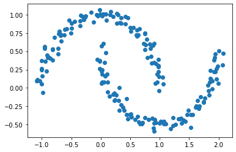
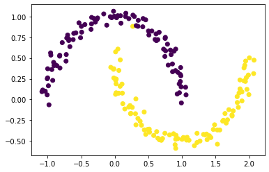
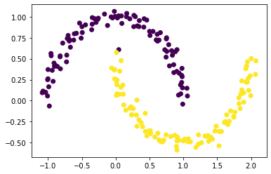
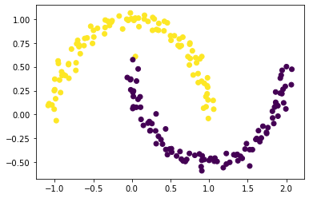
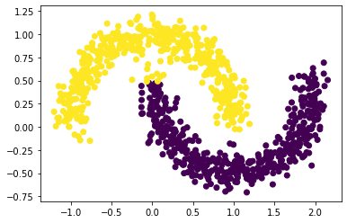
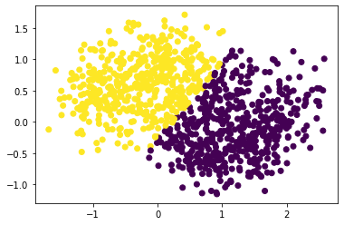
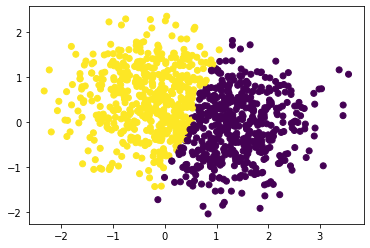
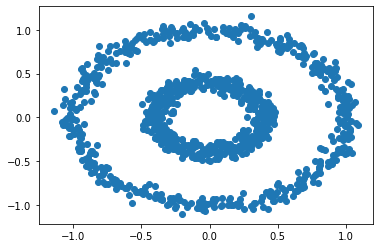
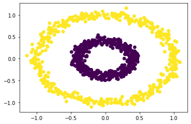

# Spectral Clustering

In this blog post, I will demonstrate how to implement spectral clustering in Python. 

First, let's plot out our data points.

```python
import numpy as np
from sklearn import datasets
from matplotlib import pyplot as plt
np.random.seed(1234)
n = 200
X, y = datasets.make_moons(n_samples=n, shuffle=True, noise=0.05, random_state=None)
plt.scatter(X[:,0], X[:,1])
```

    <matplotlib.collections.PathCollection at 0x11cd48550>


    



Our job is to correctly segregate data points into the two crescents. 

## Construct Similarity Matrix

We will first construct a similarity matrix, A, which flags points that are within distance *epsilon* from each other. Here, we specify *epsilon* = 4.

```python
epsilon = 0.4
A = np.zeros((n, n))
from sklearn.metrics import pairwise_distances
A[pairwise_distances(X) < epsilon] = 1
np.fill_diagonal(A, 0)
A
```


    array([[0., 0., 0., ..., 0., 0., 0.],
           [0., 0., 0., ..., 0., 0., 0.],
           [0., 0., 0., ..., 0., 1., 0.],
           ...,
           [0., 0., 0., ..., 0., 1., 1.],
           [0., 0., 1., ..., 1., 0., 1.],
           [0., 0., 0., ..., 1., 1., 0.]])


## Compute Cut Objective

Now, clustering data points is the same as parcelling rows and columns of `A`. Therefore, we will compute the binary norm cut objective of `A`. This is equal to: 

$$N_{\mathbf{A}}(C_0, C_1)\equiv \mathbf{cut}(C_0, C_1)\left(\frac{1}{\mathbf{vol}(C_0)} + \frac{1}{\mathbf{vol}(C_1)}\right)\;.$$

### $cut(C_0, C_1)$

This terms is computed by summing all entries in A whose row number is in $C_0$ and column number is in $C_1$. In other words, this measures the amount of points that are close to each other but are in different clusters. We want this number to be as small as possible, which would indicate good clustering. 

```python
def cut(A, y):
    # cluster membership
    c1 = np.nonzero(y)[0] 
    c0 = np.where(y==0)[0]
    # compute cut objective by summing up all entries whose row number is in C_0 and column number is in C_1
    cut_obj = sum([A[i, j] for i in c0 for j in c1])
    return cut_obj
```

To prove that cut objective is smaller for true clusters than for random clusters:

```python
cut_obj = cut(A, y)
np.random.seed(1234)
# random labels
labels = np.random.randint(0, 2, size = (n,))
cut_obj_rand = cut(A, labels)
print(cut_obj) # cut objective based on true labels
print(cut_obj_rand) # cut objective based on random labels
```

    13.0
    1154.0

### $(1/vol(C_0) + 1/vol(C_1))$

We will now compute the volumes of the clusters, which is the sum of degrees of rows that are in C_0 and C_1.

```python
def vols(A, y):
    # cluster membership
    c1 = np.nonzero(y)[0] 
    c0 = np.where(y==0)[0]
    # compute volumes by summing up degrees
    v1 = np.sum(A[c1, :])
    v0 = np.sum(A[c0, :])
    return (v0, v1)
```

### Norm cut

Finally, putting cut objective and volume term together:

```python
def normcut(A, y):
    return cut(A, y) * (1/vols(A, y)[0] + 1/vols(A, y)[1])
```

Comparing normcut for true labels vs. fake labels:

```python
print(normcut(A, y)) # true labels
print(normcut(A, labels)) # fake labels
```

    0.011518412331615225
    1.023364647480206


We can see that the normcut for true labels is much smaller than that for fake labels, which makes sense since smaller normcut signals better clustering. 

## Minimze normcut(A, y) by Transforming y to z

We now know that clustering data points is the same as finding `y` that minimizes `normcut(A, y)`. However, this is an NP-hard combinatorial optimization problem. We can find a workaround by defining another vector, `z`, that contains all the information in `y`, and showing that `normcut(A, y)` is related to a function of `z`. Thus, our task now becomes minimizing this function of `z`. 

The vector `z` is defined such that: 

$$
z_i = 
\begin{cases}
    \frac{1}{\mathbf{vol}(C_0)} &\quad \text{if } y_i = 0 \\ 
    -\frac{1}{\mathbf{vol}(C_1)} &\quad \text{if } y_i = 1 \\ 
\end{cases}
$$

```python
def transform(A, y):
    vol0 = vols(A, y)[0]
    vol1 = vols(A, y)[1]
    z = np.full((n,), 1/vol0)
    z[y==1] = -1/vol1
    return z
```

We know that: 

$$\mathbf{N}_{\mathbf{A}}(C_0, C_1) = \frac{\mathbf{z}^T (\mathbf{D}-\mathbf{A})\mathbf{z}}{\mathbf{z}^T\mathbf{D}\mathbf{z}}\;,$$

where `D` is a diagonal matrix with diagonal entries being degrees (i.e., row sums) in A. To prove this:

```python
z = transform(A, y)
D = np.zeros((n, n))
np.fill_diagonal(D, np.sum(A, axis = 1))
np.isclose((z@(D-A)@z)/(z@D@z), normcut(A, y))
```

    True


Also, we can show that $\mathbf{z}^T\mathbf{D}\mathbb{1} = 0$, which suggests that `z` contains roughly as many points in C0 as in C1.

```python
z.T@D@np.ones(n)
```

    0.0


## Explicitly Minimize the Function of z

Now, we can try explicitly minimizng the function of z, which we have shown to be equal to normcut(A, y).

```python
def orth(u, v):
    return (u @ v) / (v @ v) * v

e = np.ones(n) 

d = D @ e

def orth_obj(z):
    z_o = z - orth(z, d)
    return (z_o @ (D - A) @ z_o)/(z_o @ D @ z_o)

import scipy
z_min = scipy.optimize.minimize(orth_obj, np.ones(len(y))).x
```

Let's see how `z_min` does in clustering our data points.

```python
plt.scatter(X[:,0], X[:,1], c = [z_min >= 0])
```

    <matplotlib.collections.PathCollection at 0x1211d30d0>



   

Seems like it's doing a great job! There are very few points that have been misclassified. 

## Construct the Laplacian Matrix

However, explicit minimization is computationally expensive. The Rayleigh-Ritz Theorem suggests that we can solve this problem by finding the eigenvector with the second-smallest eigenvalue of the matrix $D^(-1)(D-A)$, which we call the *Laplacian matrix*. 

```python
L = np.linalg.inv(D)@(D-A)
# find eigenvectors and eigenvalues of the Laplacian matrix
Lam, U = np.linalg.eig(L)
# extract the eigenvector with the second-smallest eigenvalue
z_eig = U[:, np.nonzero(Lam == sorted(Lam)[1])]
```

Let's see how *z_eig* does in clustering our data points.

```python
plt.scatter(X[:,0], X[:,1], c = [z_eig>=0])
```

    <matplotlib.collections.PathCollection at 0x121242a50>


    



Looks like it's also doing a great job! There is perhaps only one or two misclassified points. 

## Putting Everything Together

Let's write a function that synthesizes all the previous steps.

```python
def spectral_clustering(X, epsilon):
    """
    This function takes in an array of Euclidean coordinates (X) and a distance threshold (epsilon).
    It first constructs the similarity matrix A, which flags points that are within the distance threshold.
    It then constructs the Laplacian matrix L = D^-1(D-A), where D is a diagonal matrix with diagonal element d_ii = d_i
    Finally, it computes the eigenvector with the 2nd-smallest eigenvalue of the Laplacian matrix.
    It returns labels based on this eigenvector.
    """
    # n = no. of datapoints
    n = len(X[:,0])
    # construct the similarity matrix
    A = np.zeros((n, n))
    A[pairwise_distances(X) < epsilon] = 1
    np.fill_diagonal(A, 0)
    
    # construct the diagonal matrix containing degrees
    D = np.zeros((n, n))
    np.fill_diagonal(D, np.sum(A, axis = 1))
    
    # construct the Laplacian matrix
    L = np.linalg.inv(D)@(D-A)
    
    # computes the eigenvector with the 2nd-smallest eigenvalue of the Laplacian matrix
    Lam, U = np.linalg.eig(L)
    z_eig = U[:, np.nonzero(Lam == sorted(Lam)[1])]
    
    # return vector of labels
    return list(map(int, z_eig<0))
```

```python
plt.scatter(X[:,0], X[:,1], c=spectral_clustering(X, epsilon))
```

    <matplotlib.collections.PathCollection at 0x120cedf50>


    



## Testing the Algorithm on Multiple Datasets

Let's see how generalizable our algorithm is to other scenarios.

```python
# noise = 0.1
n = 1000
X, y = datasets.make_moons(n_samples=n, shuffle=True, noise=0.1, random_state=None)
plt.scatter(X[:,0], X[:,1], c=spectral_clustering(X, epsilon))
```


    <matplotlib.collections.PathCollection at 0x120fb3f50>


    


```python
# noise = 0.3
n = 1000
X, y = datasets.make_moons(n_samples=n, shuffle=True, noise=0.3, random_state=None)
plt.scatter(X[:,0], X[:,1], c=spectral_clustering(X, epsilon=0.35))
```


    <matplotlib.collections.PathCollection at 0x12af9b350>


    



```python
# noise = 0.6
n = 1000
X, y = datasets.make_moons(n_samples=n, shuffle=True, noise=0.6, random_state=None)
plt.scatter(X[:,0], X[:,1], c=spectral_clustering(X, epsilon=0.6))
```


    <matplotlib.collections.PathCollection at 0x12343a8d0>


    


It seems like as `noise` increases, it becomes harder for our algorithm to identify the two crescents. Furthermore, `epsilon` needs to be greater than or equal to `noise` for the algorithm to work, otherwise `D` will not be invertible. 

## Testing the Algorithm on Another Data Configuration -- Bulleye

Finally, let's try extending our algorithm to another configuration of data -- bulleye. 

```python
n = 1000
X, y = datasets.make_circles(n_samples=n, shuffle=True, noise=0.05, random_state=None, factor = 0.4)
plt.scatter(X[:,0], X[:,1])
```


    <matplotlib.collections.PathCollection at 0x123d110d0>




```python
plt.scatter(X[:,0], X[:,1], c=spectral_clustering(X, epsilon=0.5))
```


    <matplotlib.collections.PathCollection at 0x123ded4d0>


    


Through experimentation, I found that an epsilon between 0.2 and 0.5 can lead to correct classification of data points into two concentric circles, while other values resulted in incorrect clustering. 


